# （归档）20250727如何一个月拿到业余无线电台操作证书/执照？--考证全攻略

# 1 概述

使用业余无线电台电台一共需要两个证：**业余无线电台操作证书**与**无线电台执照**。这二者的关系与驾驶证/行驶证的关系类似，但是也有一些差别。你要是想操作业余无线电台（驾驶汽车），那么你需要具备操作证书（个人有驾驶证）并且电台具备电台执照（车辆有行驶证）。这就意味着如果你想操作电台，你可以自己具备操作证书，使用别人的电台进行收发，由别人对你的收发行为负责。**但是如果你想自己设置无线电台的话，你必须首先具备操作证书才可以申请设置。**这个是与驾驶车辆的不同之处，因为没有驾照也可以办理行驶证，行驶证主要用于证明车辆的合法性，与是否持有驾驶证无关。

本篇文章是用于记录我个人考取操作证书和设置无线电台的过程，帮助一些人更加了解业余无线电的报名流程-考试准备-操作证书领取-电台执照申请这些宏观层面的事情。此外，本人针对于A级操作能力（旧版）的考试内容单独整理了一篇文章，里面对题库进行了系统性的知识梳理，可以帮助大家更好的了解整个知识体系，方便大家进行操作能力考试准备。链接如下：[https://zhuanlan.zhihu.com/p/1940118151024050586](https://zhuanlan.zhihu.com/p/1940118151024050586 "https://zhuanlan.zhihu.com/p/1940118151024050586")。

若想考取操作证书，需要首先关注自己所在省份的无线电协会网址（北京[http://www.bjwxdxh.org.cn/index.php](http://www.bjwxdxh.org.cn/index.php "http://www.bjwxdxh.org.cn/index.php")），上面会发布报名等通知。

# 2 时间节点安排

## 2.1 操作能力验证证书

- 20250727：了解无线电考证流程，明确最近的考试日期是8月16日
- 20250728-20250816：背题库，梳理知识体系，总结成学习记录
- 20250729：北京无线电协会业余无线电服务平台 信息审核通过
- 20250802：上午九点开始预约
- 20250814：北京无线电协会官网发布16日考试名单
- 20250816：**15:30正式考试**，地点在北京赛欧科技园孵化中心1号楼13层
- 20250820：北京无线电协会官网发布16日考试合格名单，**考试通过了**
- 20250822：操作证批号公布，**操作证书做好了**，快递邮寄操作方式，证书编号查询
- 20250823：**拿到操作证书**

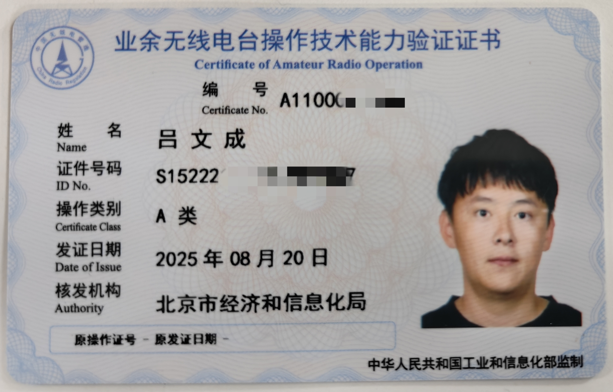

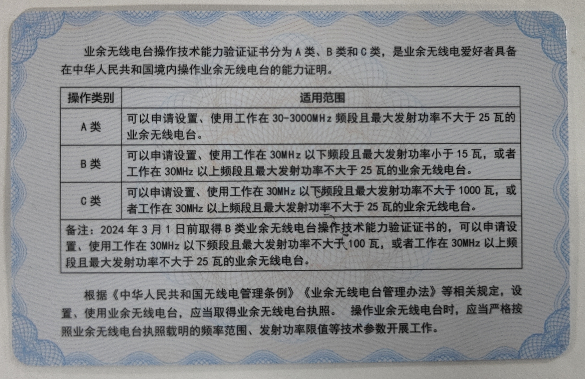

## 2.2 电台执照办理

- 20250823：无线电台设备购买
- 20250824：无线电台执照申请
- 20250825：第一次申请未通过，非北京户口需要提供居住地点
- 20250901：增加学生证补充说明，审核通过
- 20250925：官网公布执照领取通知
- 20250927：电台执照到手，完美收官

# 3 准备阶段

## 3.1 报名操作

20250727：关注报考通知，首先上官网查询（[http://www.bjwxdxh.org.cn/index.php](http://www.bjwxdxh.org.cn/index.php "http://www.bjwxdxh.org.cn/index.php")）最近的考试在什么时候？我关注的日期最近的（8月16日）报考通知链接：[http://www.bjwxdxh.org.cn/news/html/?1291.html](http://www.bjwxdxh.org.cn/news/html/?1291.html "http://www.bjwxdxh.org.cn/news/html/?1291.html")。**上面会有报考资格、报名流程、考试方式和报名开始/结束时间和其他注意事项。**

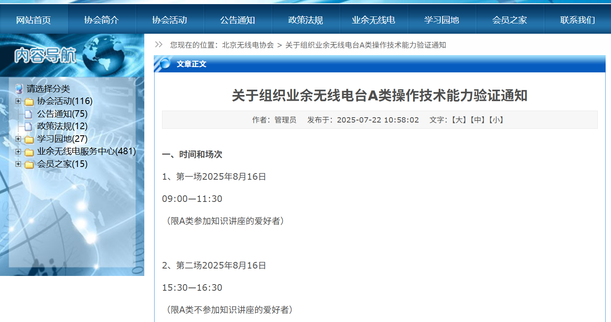

20250727：进入服务平台选择A类验证按步骤进行注册，填写北京市业余无线电技术操作能力认证申请表（2014版） A类。

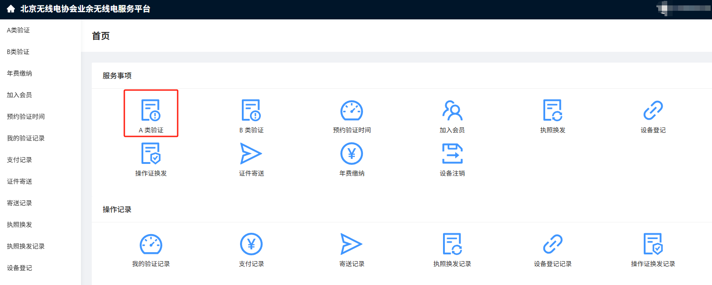

20250729：信息审核通过，之后才能进行考试报名

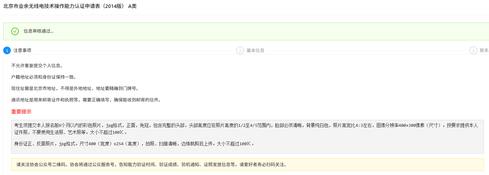

20250802：上午9点打开预约通道，首先点击左侧“预约验证时间”进行报名，报名成功后在“我的预约记录”中会有状态更新。

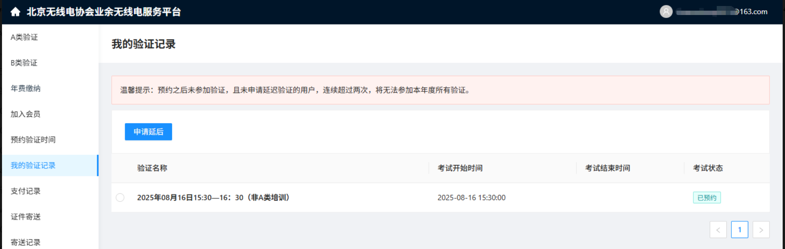

## 3.2 备考经验

参照我的另一篇文章[https://zhuanlan.zhihu.com/p/1940118151024050586](https://zhuanlan.zhihu.com/p/1940118151024050586 "https://zhuanlan.zhihu.com/p/1940118151024050586")。文章梳理了业余无线电考试所有相关的知识体系，方便大家备考。

# 4 考试阶段

## 4.1 考试通知

通知链接：[http://www.bjwxdxh.org.cn/news/html/?1309.html](http://www.bjwxdxh.org.cn/news/html/?1309.html "http://www.bjwxdxh.org.cn/news/html/?1309.html")

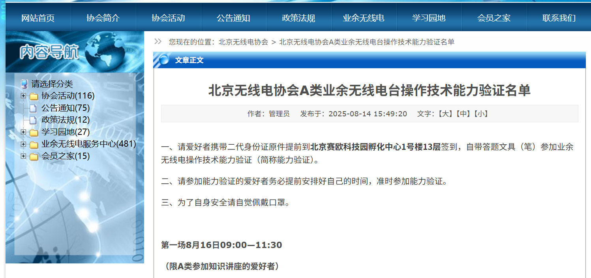

一共分为两场，我的是第二场：

第一场8月16日09:00—11:30（限A类参加知识讲座的爱好者）

第二场8月16日15:30—16:30（限A类不参加知识讲座的爱好者）

## 4.2 考试过程

地点：北京赛欧科技园孵化中心1号楼13层

时间：根据通知上时间来

考试必备物品：身份证和答题文具

答题方式：北京目前还是纸质答题纸，答题卡上每个选择题用空白圆圈表示，使用圆珠笔或者铅笔把相应答案的空白圆圈全部涂黑就行

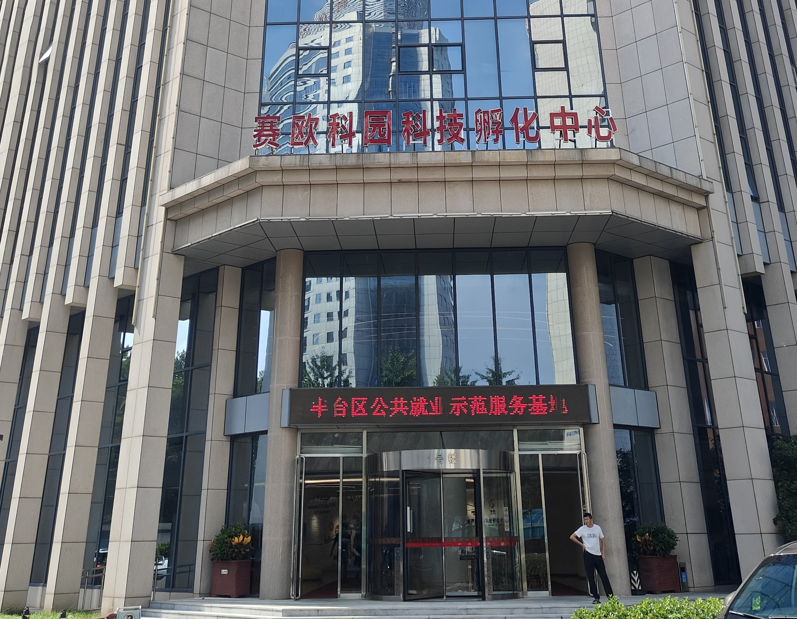

# 5 操作证书

## 5.1 考试结果通知

考试是否合格一个通知，这个通知一般三个工作日内就会有结果。

20250820-合格名单公布：[http://www.bjwxdxh.org.cn/news/html/?1316.html](http://www.bjwxdxh.org.cn/news/html/?1316.html "http://www.bjwxdxh.org.cn/news/html/?1316.html")。我统计了下本次报名A类考试的人数为301人，合格人数为199人，合格人数占比66%。

官网通知信息：

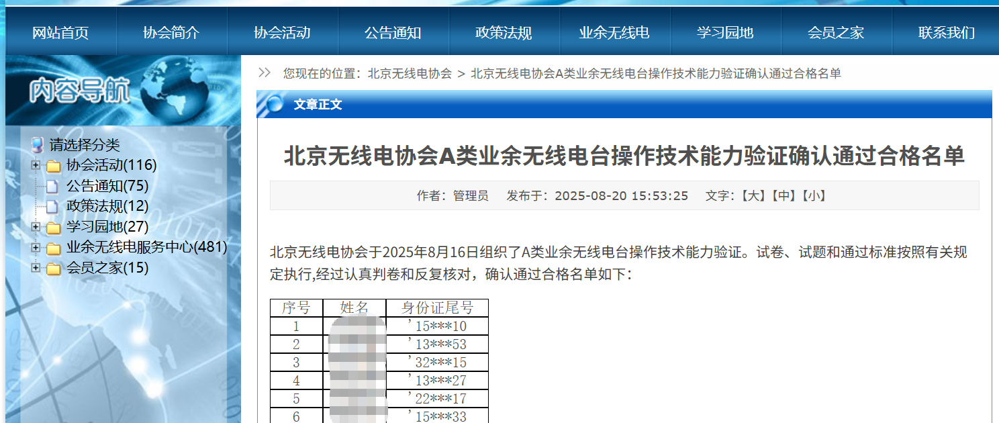

个人界面查询：

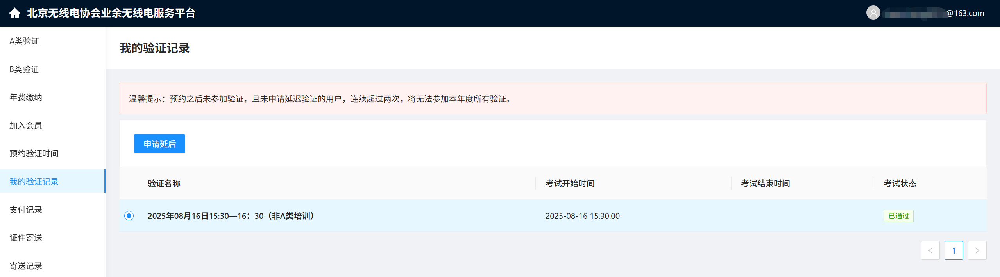

## 5.2 操作证书领取

20250822：协会公布操作证批次，在里面寻找是否有自己的名字。协会提供线下领取和快递邮寄两种方式，我选择的是快递邮寄方式，下面是具体操作方式。

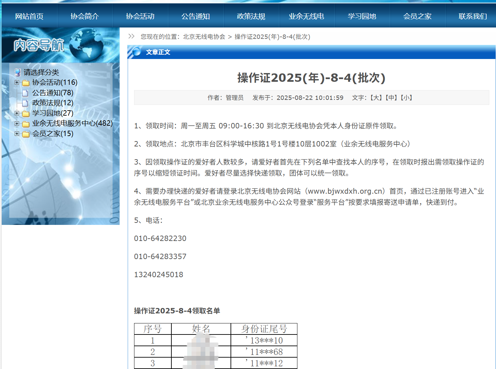

在“证件寄送”一栏填写基本信息和邮寄地址，注意“年/批次/序号”一定要按照官网通知或者微信公众号填写。

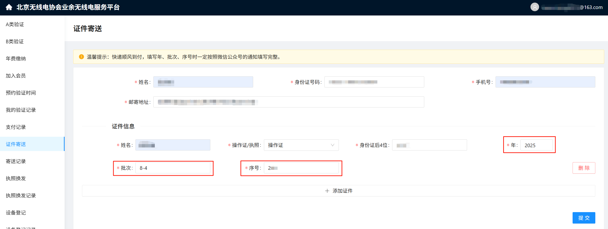

点完提交之后，“寄送记录”一栏的“邮寄状态”变为“待审核”

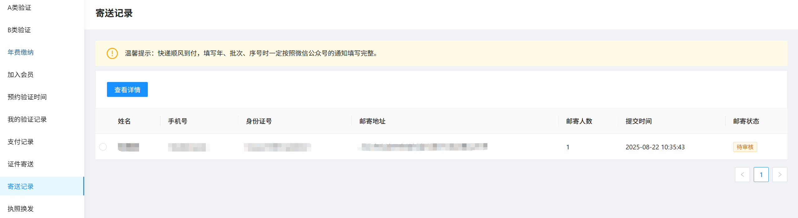

## 5.3 证书编号查询

**查询方式：**通过电脑网页浏览器进入[http://www.crac.org.cn/](http://www.crac.org.cn/ "http://www.crac.org.cn/")后，选择底部“证书查询”，输入姓名+身份证号、或者姓名+证书编号，如系统后台有关信息（字母一律大写，不要有空格），即可显示个人操作证书概要信息。（其他查询方式比如“智谱”参照下面链接[http://82.157.138.16:8091/CRAC/crac/pages/list\_detail.html?type=NA==](http://82.157.138.16:8091/CRAC/crac/pages/list_detail.html?type=NA== "http://82.157.138.16:8091/CRAC/crac/pages/list_detail.html?type=NA==")）

**查询时间：**我是在8月22日北京协会出通知后才查询的，但是我看证书编号查询网址上面的核发日期为8月20日。我推测是20号考试合格名单公布之后证书编号就确定了，但是纸质的操作证书还没有做好，这个做好的日期是22号，才公布的领取通知。

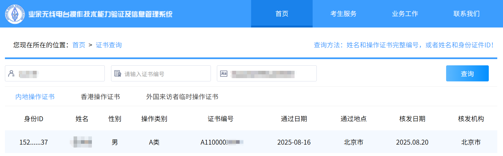

# 6 电台执照

## 6.1 设备购买

买业余无线电台时，需要注意核准码一定要和官方公布的对应，我目前看的销量高的在核准码里都能查询得到。查询网址：[业余电台核准代码查询-2025.08.29-北京无线电协会](http://www.bjwxdxh.org.cn/news/html/?1322.html "业余电台核准代码查询-2025.08.29-北京无线电协会")

## 6.2 执照申请

20250824开始申请，在官网平台填写“设备登记”栏

**步骤一**

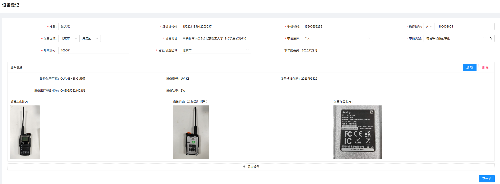

**步骤二**

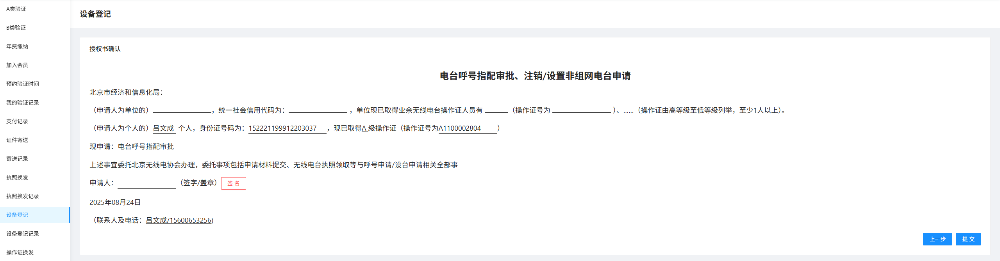

**填写完成，等待结果**

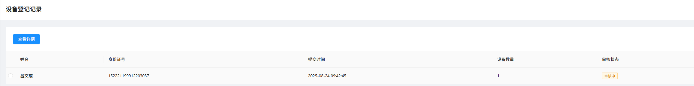

**第一次信息审核未通过**：系统提示—如果您是北京市户口，则不需要上传居住证。居住证明只需要上传信息页；需要提供北京市居住证，或居委会开具的居住证明，咨询电话:64282230;

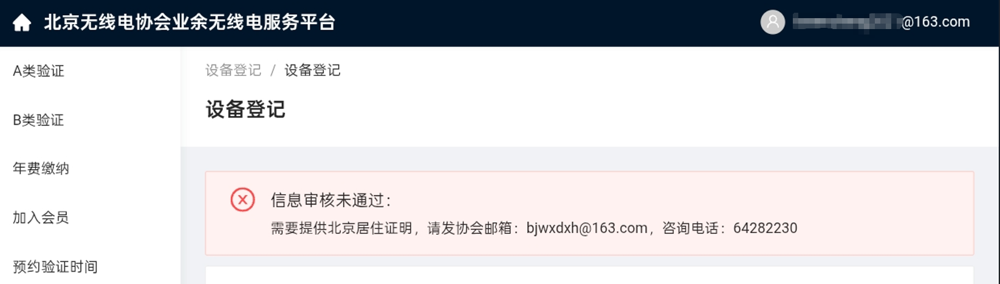

**第二次信息审核通过（20250901）**：本人补充了学生证图片和学校开具的居住证明图片。

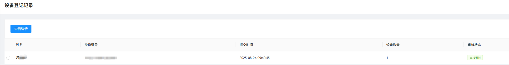

## 6.3 执照领取

20250925：官网公布执照领取信息：[执照2025(年)-9-3(批次)-北京无线电协会](http://www.bjwxdxh.org.cn/news/html/?1331.html "执照2025(年)-9-3(批次)-北京无线电协会")

电台执照快递领取方式和操作证书快递领取方式一致，请参照“操作证书领取”章节

20250927：无线电台执照到手，完美收官！

