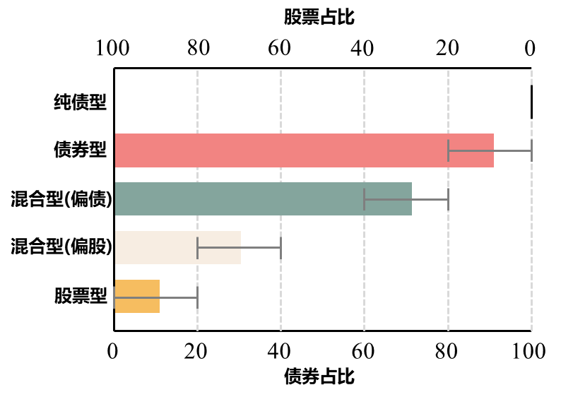
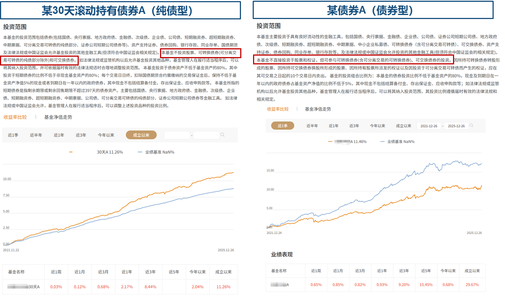
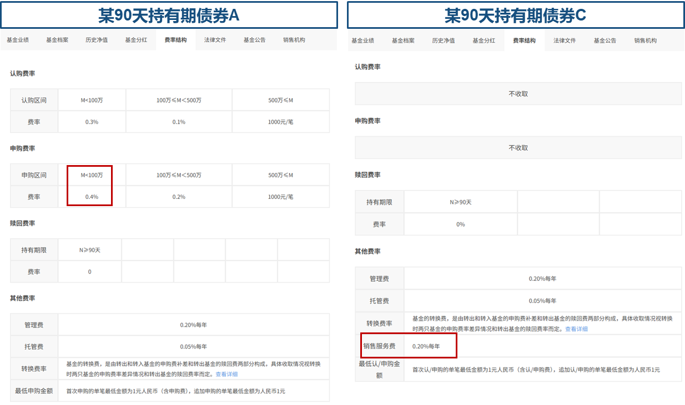
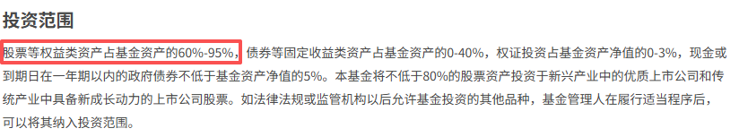
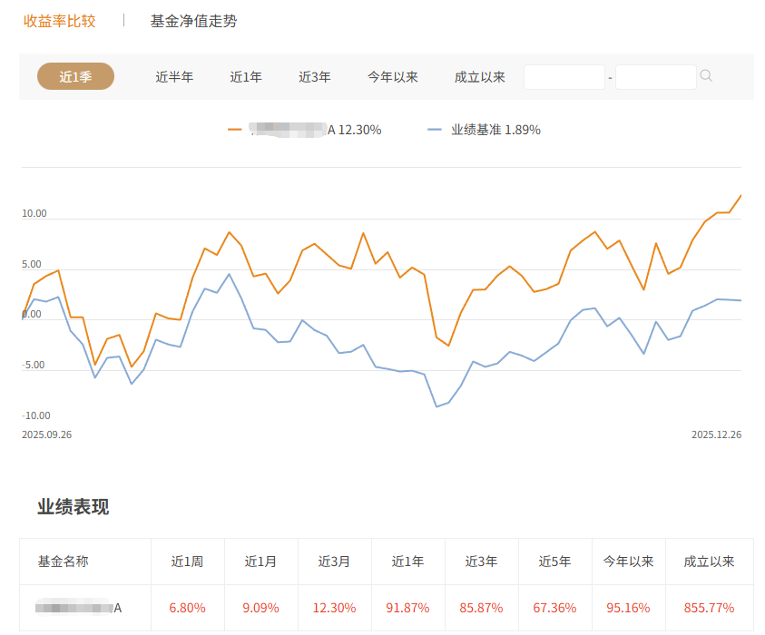
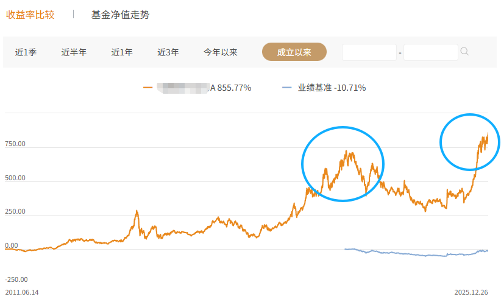

# 「个人理财实操指南」：手把手教你制定计划、挑选基金，附真实案例分析

## 目录

- [1 个人理财计划](#1-个人理财计划)
  - [1.1 理财计划](#11-理财计划)
  - [1.2 具体实施方式](#12-具体实施方式)
- [2 我是如何选基金的？](#2-我是如何选基金的)
  - [2.1 基金都分为哪些类型？](#21-基金都分为哪些类型)
  - [2.2 基金的A类与C类份额如何选择？](#22-基金的A类与C类份额如何选择)
  - [2.3 持有期限规定](#23-持有期限规定)
  - [2.4 如何分析基金？](#24-如何分析基金)
  - [2.5 基金分析实例](#25-基金分析实例)
- [3 进阶版—债券利率固定为什么会出现波动？](#3-进阶版债券利率固定为什么会出现波动)
  - [3.1 （纯债型基金）为什么普通债券会波动？](#31-纯债型基金为什么普通债券会波动)
  - [3.2 （债券型基金）为什么可转债的波动特别大？](#32-债券型基金为什么可转债的波动特别大)
- [4 （已归档）定投计划](#4-已归档定投计划)
  - [环节一：基石——不间断的基础定投](#环节一基石不间断的基础定投)
  - [环节二：关键机遇——分级式回调加仓 (策略增强器)](#环节二关键机遇分级式回调加仓-策略增强器)
  - [环节三：风控与纪律——年度资产再平衡](#环节三风控与纪律年度资产再平衡)

# 1 个人理财计划

## 1.1 理财计划

**1. 基石：不间断的自动定投（标普）**
每月固定投入标普基金3000，通过天弘（日均50）和摩根（日均100）平台执行自动定投。此环节的核心是严格纪律，不因市场波动而改变计划，旨在平滑成本、规避择时风险，构建长期持仓的基本盘。

同时，将债券部分配置于摩根旗下的纯债基金（年化约2%），作为稳定器。

**2. 增强：分级式回调加仓**
此环节利用市场波动追加投资，以寻求超额收益。具体操作依据标普500指数从一年内高点的回撤幅度来触发：

- **第一级（回撤5%-10%）**：从备用现金池中取出约5k（约10%-20%）进行一次加仓，旨在小幅优化成本。
- **第二级（回撤10%-20%）**：视为核心机会，从现金池中取出约1w（约40%-60%）进行重点加仓，以大幅降低平均成本。
- **第三级（回撤≥20%）**：将现金池剩余资金分2-3批、每隔1-2个月投入市场。此时需保持耐心，认识到市场可能长期低迷，并使用绝对闲钱投资以应对浮亏。

**3. 纪律：年度资产再平衡**
每年在固定日期（12月31日）执行一次强制调整。检查并卖出标普500基金中超过90%仓位比例的部分，用所得资金买入纯债基金，使股债配置严格恢复至9：1的目标比例。此操作能自动实现“高卖低买”、锁定部分利润、控制整体风险，并为备用现金池补充资金，为下一次回调加仓储备“弹药”。

## 1.2 具体实施方式

定投计划在基金平台上购买：

- 天弘标普基金
- 摩根标普基金
- 摩根纯债基金

加仓计划在股票平台上购买：

- 标普ETF

# 2 我是如何选基金的？

## 2.1 基金都分为哪些类型？

股票型：以股票为主要投资标的。根据监管规定，其**股票持仓比例不低于80%**

混合型(偏股)：同时投资股票、债券等，但**股票配置比例较高**。通常其业绩比较基准中股票占比不低于60%

混合型(偏债)：同时投资债券、股票等，但**债券持仓下限通常不低于60%**。采用“**固收筑底、权益增强**”策略。

债券型：**80%以上的基金资产投资于债券**。不参与股票投资（包括新股申购）的称为“**纯债基金**”

- 货币基金：国债、央行票据、银行存单等短期货币工具
- 纯债基金：国债、金融债、信用债等各类债券，**不投资股票**
- “固收+”基金：**大部分（通常>80%）投资债券**，同时以不超20%的比例投资股票、可转债等争取更高收益

货币型：仅投资于货币市场工具，如国债、央行票据、银行定期存单等短期有价证券

指数型：被动跟踪特定市场指数（如沪深300）表现的基金。可细分为**被动指数型**和**指数增强型**

**如何区分纯债基金和债券型基金？这个需要看基金档案**

“是否投资可转换债券（可转债）”是区分“纯债基金”和“非纯债基金”的核心标志之一。

**纯债型基金**：**不投资**于权益资产（股票、可转债等）。主要投资国债、金融债、信用债等。

**债券型基金：** ​**最高用20%的仓位投资可转债和可交换债**。这类资产兼具债性和股性，在股市向好时可能获得比普通债券更高的收益，但同时波动和风险也更大。

上图展示了纯债型基金（左）和债券型基金（右）的2021年到2025年收益率曲线，橙色线表示。可以看出，债券型比纯债型波动更大，但总的收益率其实差不了多少。

## 2.2 基金的**A类与C类份额如何选择？**

- **费用计算是关键**：这本质上是**前端收费**与**后端收费**的区别。A类在你买入时一次性收取申购费；C类不收取申购费，但会按日计提销售服务费（年费率通常在0.1%-0.4%左右）。
- **选择建议**：这笔账主要看你的**计划持有时间**。如果打算**长期持有（例如一年以上）**，一次性付清申购费的A类通常更划算。如果只是**短期投资**，那么免申购费的C类成本更低。你可以根据C类的具体销售服务费率，大致估算出一个“成本平衡点”。

举例：持有某90天持有期债券A基金1w，则申购费为10000\*0.4%=40；持有某90天持有期债券C基金1w，则一年的销售服务费为10000\*0.2%\*1=20；持有某90天持有期债券C两年的话是费用是40和申购债券A费用一致。**一定要注意：现在大部分基金都可以1折甚至0折费率购入，这样的话A类短期也可能更合适。找基金官方平台、x付宝、x花顺比较一下。**

## 2.3 持有期限规定

- 普通开放式（无持有期）：随时赎回。（一般T+1到账）
- 固定持有期（如90天）：有条件赎回。（1）持有期内不可赎回。（2）持有期满后任何交易日均可自由赎回，无限制。
- 滚动持有期（如30天）：有条件赎回。仅在每个运作周期到期日可申请赎回。若不操作，自动进入下一周期。你需要**在特定的“到期日”进行赎回操作**，才能取出资金，错过了就要再等一个周期。这对于管理现金流的要求更高。

**一般来说，持有期限规定都会在基金名称上写出，如“xx90天持有期”“xx30天滚动持有”**

## 2.4 如何分析基金？

1. 看基金档案，明确基金类型
2. 看收益能力和风险控制水平
   1. 收益率：优先关注**长期（3-5年）业绩**，这比短期爆发力更能说明基金经理的稳定能力。
   2. 最大回撤：在选定周期内，净值从高点跌倒低点的最大跌幅。同样收益下，回撤越小越好。
   3. 夏普比率：衡量基金每承受一单位总风险，能产生的超额回报。该比率越高，说明基金的收益“性价比”越高。
3. 看费率结构
   1. 认购费/申购费：购买基金时支付的“入场手续费”。认购费针对新发基金，申购费针对已上市基金。
   2. 赎回费：卖出基金时支付的“离场手续费”。
   3. 管理费：支付给基金公司，用于其投资研究、运营管理的报酬。
   4. 托管费：支付给托管银行，用于保管基金资产、监督运作的费用。

## 2.5 基金分析实例

任何基金都可以分为股票型、混合型(偏股)、混合型(偏债)和债券型基金。

1）以这个子女教育的基金为例，显示的成立以来收益率855.77%，很有诱惑力。

2）点进去分析基金档案，其股票类资产占据了60%到95%，属于股票型或者混合型(偏股)。具有较高的投资风险。

3）点进去之后发现收益率也不错，所有指标全是红的。

4）但是点开成立以来的收益率，发现21年的时候有一个高峰，害怕大家在现在这个时间点购买基金被套牢，所以一定要慎重，多分析他的指标，不要被表面的几个数据迷惑

# 3 进阶版—债券利率固定为什么会出现波动？

**问题：比如说我持有一张债券，利率是2%，那么它的利息就一直是固定的，为什么会有波动？**

核心原因在于：持有的债券本身，是一个可以在市场上随时买卖的“商品”。它的市场价格（基金净值）和它作为一张“借条”的票面价值（比如100元）以及利息，是两套不同的定价系统。

为了彻底理清，我们分两步来看：

## 3.1 （纯债型基金）为什么普通债券会波动？

想象你有一张“未来科技”发行的债券，面值100元，年息3%，期限5年。

1. **持有到期情景（如你所想）**：如果你真的一直持有5年，那么你每年固定拿到3元利息，最后拿回100元本金。不考虑公司倒闭，这个现金流是确定的。
2. **市场交易情景（基金的真实情况）**：但公募基金不会把所有债券都持有到期，它需要应对申购赎回，也会主动交易。这张债券每天在**二级市场**上像股票一样被买卖，它的**交易价格会实时变动**。

**导致价格波动的三大主因：**

- **利率变化**：如果央行加息，新发行的债券利息变成4%，那你手里这张3%的旧债券就失去了吸引力。别人想买它，就会**压价**（比如只出98元），直到它的实际收益率接近4%为止。反之，降息时旧债券会更值钱。
- **信用风险变化**：如果发行公司“未来科技”经营恶化，大家担心它未来还不起钱，这张债券就会被打折抛售，价格下跌。
- **市场供需**：像所有商品一样，买的人多就涨，卖的人多就跌。

**基金每日的净值，就是根据其持有的所有债券的【当前市场价格】计算出来的。** 所以，即使利息稳定，债券本身的市价在变，基金净值就会波动。

## 3.2 （债券型基金）为什么可转债的波动特别大？

对于可转债/可交换债，除了以上债券属性的波动，它**内含的“转股权”这个期权价值波动更剧烈**。

我们再用之前的例子：一张“未来科技”可转债，面值100元，转股价10元。

| 情景                | 核心逻辑                                    | 债券价格如何表现                                                             |
| ----------------- | --------------------------------------- | -------------------------------------------------------------------- |
| **正股股价大涨至15元**​   | 转股权的价值变得极高（因为一转手就赚50%）。这时，债券本身的利息已微不足道。 | 债券价格会\*\*紧紧跟随股价上涨\*\*，可能涨到150元或更高。\*\*股性主导，波动像股票。\*\*                |
| **正股股价暴跌至8元**​    | 转股权暂时无利可图（行权就亏），价值归零。                   | 债券价格会\*\*跌回其作为普通债券的价值\*\*（可能只有90多元），并受利率、公司信用影响。\*\*债性主导，波动像信用债。\*\* |
| **正股股价在转股价附近震荡**​ | 转股权处于“可能赚钱”的临界状态，其价值对股价波动极其敏感。          | 债券价格会\*\*随着股价上蹿下跳\*\*，体现出“股债双高波动”的特性。                                |

**简单比喻：**

- 你把钱借给朋友（债券），他打了张借条答应还本付息（利息确定）。
- 但这张借条**附加了一个条款**：如果他公司的股份大涨，你可以用很便宜的价格把这些借款换成股份（转股权）。
- 现在，这张 **“借条+条款”** 被放在一个市场上公开买卖。市场的出价，不仅取决于朋友的信誉和当前利率（债的部分），更**疯狂地取决于**他公司股份的涨跌预期（期权的部分）。
- **基金，就持有很多张这样的“复合借条”**。每天市场对这些借条的报价都在变，所以基金净值当然会波动。

# 4 （已归档）定投计划

## **环节一：基石——不间断的基础定投**

- **操作方式：** 严格执行预设计划，不因市场波动而改变。
- **具体细节：**
  - 每月固定投入 **3000元** 进行自动定投。
  - 其中，通过 **天弘**（日均50元）定投。
  - 通过 **摩根**（日均100元）定投。
- **策略目的：** 确保持续参与市场，平滑投资成本，有效规避主观择时带来的风险，构筑坚实的“基本盘”。

债券买入纯债基金，选择的是摩根旗下的，年化率2%左右。

***

## **环节二：关键机遇——分级式回调加仓 (策略增强器)**

- **核心目标：** 在市场回调时进行追加投入，以实现超额收益。
- **操作依据：** 基于标普500指数从最近一年内最高点的回撤幅度。

1. **第一级：小幅回调 (回撤5%-10%)**
   - **行动：** 从“备用现金池”中，取出约 **10%-20% 的资金 (约5000元)**，进行一次追加买入。
   - **逻辑：** 这种回调较为常见，旨在小幅优化持仓成本，并保持对市场的积极参与感。
2. **第二级：中度修正 (回撤10%-20%)**
   - **行动：** **这是重点！** 从“备用现金池”中，取出约 **40%-60% 的资金 (约10000元)**，进行一次性较大力度的加仓。
   - **逻辑：** 历史经验表明，这是常见的“黄金坑”，是大幅降低整体平均成本的核心机会。
3. **第三级：进入熊市 (回撤 ≥20%)**
   - **行动：** 可以将“备用现金池”中 **剩余的全部资金** 投入市场。
   - **投入方式：** 建议分 **2-3批** 投入，每批投入间隔 **1-2个月**。
   - **重要提醒：**
     - 熊市通常持续12-18个月，需要极大的耐心和战略定力。
     - 加仓后可能面临短期浮亏，因此务必使用长期闲置资金进行投资。

***

## **环节三：风控与纪律——年度资产再平衡**

- **操作时机：** 每年固定一个日期（例如：年底或生日），对账户进行全面检查。
- **具体规则：**
  - **强制卖出：** 将标普500基金中，超出 **90%** 比例的部分。
  - **买入：** 卖出股票所得资金用于购买 **纯债基金**。
  - **目标比例：** 使股债比例严格恢复到 **90%股票 / 10%债券** 的配置状态。
- **策略目的：**
  - 自动实现“高卖低买”，锁定部分浮动利润。
  - 有效控制整体投资组合的风险敞口。
  - 通过卖出股票所得的资金，部分回流到债券/现金中，为下一次市场回调提供储备加仓的现金流。

***
